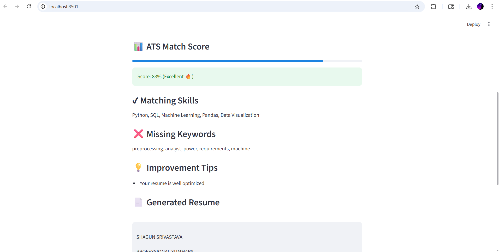

# AI Resume Builder with ATS Scoring

An AI-powered resume builder that analyzes resumes against job descriptions and provides an ATS (Applicant Tracking System) score along with keyword matching insights. Built using Streamlit for an interactive user interface.

---

## Features

* ATS Match Score with visual progress bar
* Keyword Matching (skills vs job description)
* Missing Keyword Detection
* Improvement Suggestions
* Resume Generation
* Download Resume as PDF
* Clean and interactive UI using Streamlit

---

## Tech Stack

* Python
* Streamlit
* NLP (Keyword Extraction and Matching)
* ReportLab (PDF generation)

---

## Screenshots

### ATS Score and Analysis



---

## How to Run Locally

```bash
git clone https://github.com/shagunsrivastavaa/AI-Resume-Builder-ATS.git
cd AI-Resume-Builder-ATS
pip install -r requirements.txt
streamlit run app.py
```

---

## Live Demo

(Add your Streamlit deployment link here)

---

## Use Case

This tool helps job seekers:

* Optimize resumes for ATS systems
* Improve keyword alignment
* Increase chances of shortlisting

---

## Future Improvements

* Resume upload and analysis
* Advanced NLP scoring
* Multiple resume templates

---

## Author

Shagun Srivastava

---

## License

This project is open-source and available for educational purposes.
